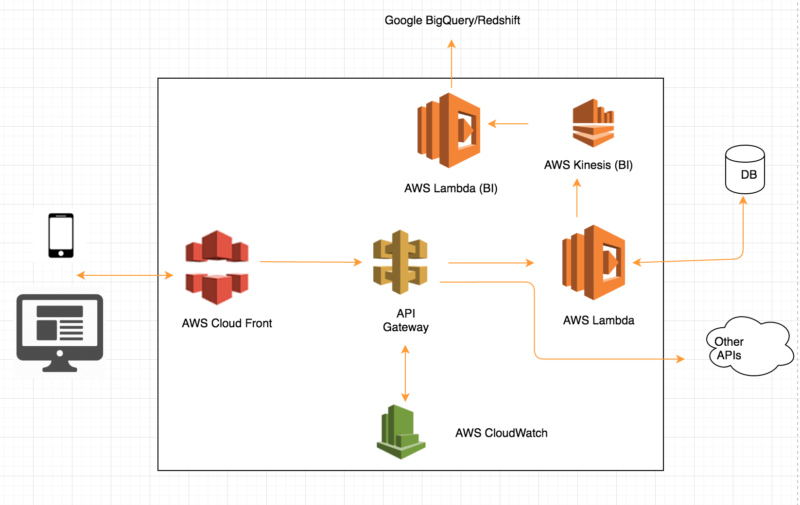

## Getting started

This project uses the [Serverless](https://github.com/serverless/serverless) framework to bootstrap and deploy both Lambda function and associated API Gateway endpoint.

**Serverless** has the concept of **stages** (e.g. `dev`, `test`, `staging`, `production`) and regions (e.g. `eu-west-1`, `us-east-1`) built-in and uses `alias` (a feature of AWS Lambda that is supported through API Gateway) to isolate deployment to different environments.
*note that each stage can be run from a different AWS account*

First, make sure you have Serverless CLI tool installed.

``npm install serverless -g``

Clone this repo and cd into the root. Install project dependencies.

``npm install``

To see a high-level summary of the app, run

``serverless dash summary``

## Deployment

Locally, you can deploy your code using `serverless`.

``serverless dash deploy``

## Test

To run the test (integration),

``npm run test``

### POSTMAN ,

``Please import the api.postman_collection.json into POSTMAN``

### Reference Architecture

=======

